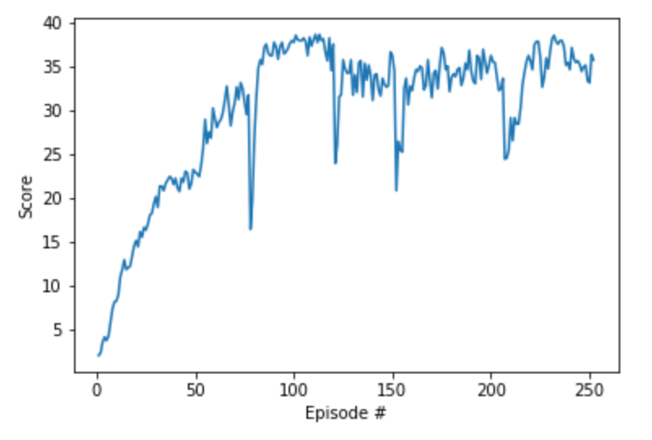

# Report

This work utilised the [DDPG](https://arxiv.org/abs/1509.02971) (Deep Deterministic Policy Gradient) architecture outlined in the original paper

## State and Action Spaces

In this environment, a double-jointed arm can move to target locations. A reward of +0.1 is provided for each step that the agent's hand is in the goal location. Thus, the goal of our agent is to maintain its position at the target location for as many time steps as possible. In our case, we used the environment version of 20 different arms.

The observation space consists of 33 variables corresponding to position, rotation, velocity, and angular velocities of the arm. Each action is a vector with four numbers, corresponding to torque applicable to two joints. Every entry in the action vector must be a number between -1 and 1.

## Learning Algorithm

It continues episodical training via the agent until `n_episoses` is reached or until the environment is solved. The  environment is considered solved when the average reward (over the last 100 episodes) is at least +30.0. Note if the number of agents is >1 then the average reward of all agents at that step is used. Since we used multiple agents version, our agent must achieve a score of +30 averaged across all 20 agents for 100 consecutive episodes.

Each episode continues until `max_t` time-steps is reached or until the environment says it's done.

As above, a reward of +0.1 is provided for each step that the agent's hand is in the goal location.

For each time step and agent the Agent acts upon the state utilising a shared (at class level) `replay_memory`, `actor_local`, `actor_target`, `actor_optimizer`, `critic_local`, `criticl_target` and `critic_optimizer` networks.

### Hyper Parameters

- n_episodes (int): maximum number of training episodes
- max_t (int): maximum number of timesteps per episode
- BUFFER_SIZE (int): replay buffer size
- BATCH_SIZ (int): mini batch size
- GAMMA (float): discount factor
- TAU (float): for soft update of target parameters
- LR_ACTOR (float): learning rate for optimizer
- LR_CRITIC (float): learning rate for optimizer
- WEIGHT_DECAY (float): L2 weight decay
- UPDATE_TIMES (int): number of learning updates
- UPDATE_EVERY (int): every n time step do update
- OU_SIGMA (float) : Ornstein-Uhlenbeck noise parameter
- OU_THETA (float) : Ornstein-Uhlenbeck noise parameter


Where 
`n_episodes=500`, `max_t=1000`, `BUFFER_SIZE = int(1e6)`, `BATCH_SIZE = 128`, `GAMMA = 0.99`, `TAU = 1e-3`, `LR_ACTOR = 1e-3`, `LR_CRITIC = 1e-3`, `WEIGHT_DECAY = 0.0`, `UPDATE_TIMES = 10`, `UPDATE_EVERY = 20`, `OU_SIGMA = 0.2` and `OU_THETA = 0.15`


### Neural Networks

Actor and Critic network models were defined in [`model.py`](https://github.com/rmoin/ContinuousControl/model.py).

The Actor networks utilised two fully connected layers with 400 and 300 units with batch norm, relu activation and tanh activation for the action space. The network has an initial dimension the same as the state size.

The Critic networks utilised two fully connected layers with 400 and 300 units with batch norm and relu activation. The critic network has  an initial dimension the size of the state size plus action size.

## Plot of rewards


```
Episode 93 (221 sec)  -- 	Min: 30.8	Max: 39.4	Mean: 35.6	Mov. Avg: 33.7
Episode 94 (220 sec)  -- 	Min: 30.8	Max: 37.7	Mean: 35.2	Mov. Avg: 33.7
Episode 95 (221 sec)  -- 	Min: 30.3	Max: 36.4	Mean: 34.4	Mov. Avg: 33.7
Episode 96 (220 sec)  -- 	Min: 31.6	Max: 38.8	Mean: 34.9	Mov. Avg: 33.7
Including Previous Runs -- Total Episodes 250  -- 	Real Mov. Avg: 29.9
Episode 97 (220 sec)  -- 	Min: 30.0	Max: 38.3	Mean: 35.1	Mov. Avg: 33.7
Episode 98 (221 sec)  -- 	Min: 27.3	Max: 38.4	Mean: 33.3	Mov. Avg: 33.7
Episode 99 (221 sec)  -- 	Min: 8.1	Max: 39.4	Mean: 33.1	Mov. Avg: 33.7
Episode 100 (221 sec)  -- 	Min: 27.0	Max: 39.4	Mean: 36.3	Mov. Avg: 33.7
Including Previous Runs -- Total Episodes 254  -- 	Real Mov. Avg: 30.0
Episode 101 (221 sec)  -- 	Min: 31.3	Max: 39.0	Mean: 35.7	Mov. Avg: 33.9

Environment SOLVED in 155 episodes!	Moving Average =30.1 over last 100 episodes

```

## Ideas for Future Work

Training occured in Udacity workspace. In earlier versions of implementations, we had trouble getting the agents to learn. To combat this, we implemented gradient clipping using the torch.nn.utils.clip_grad_norm_ function and batch normalization.

In future Proximal Policy Optimization (PPO), Trust Region Policy Optimization (TRPO) and Distributed Distributional Deterministic Policy Gradients (D4PG) methods could be explored. Also, we can explore prioritized experience replay — rather than selecting experience tuples randomly, prioritized replay selects experiences based on a priority value that is correlated with the magnitude of error. 
